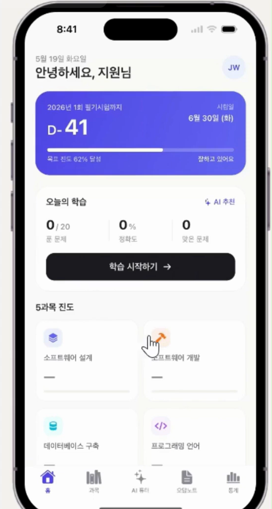
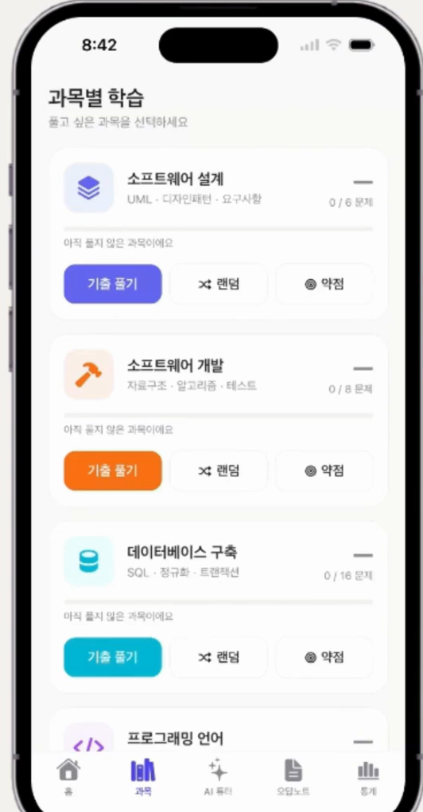
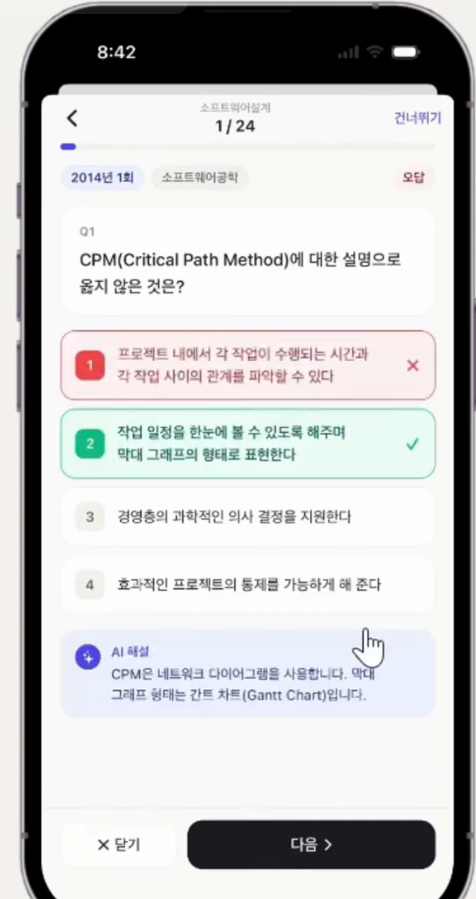
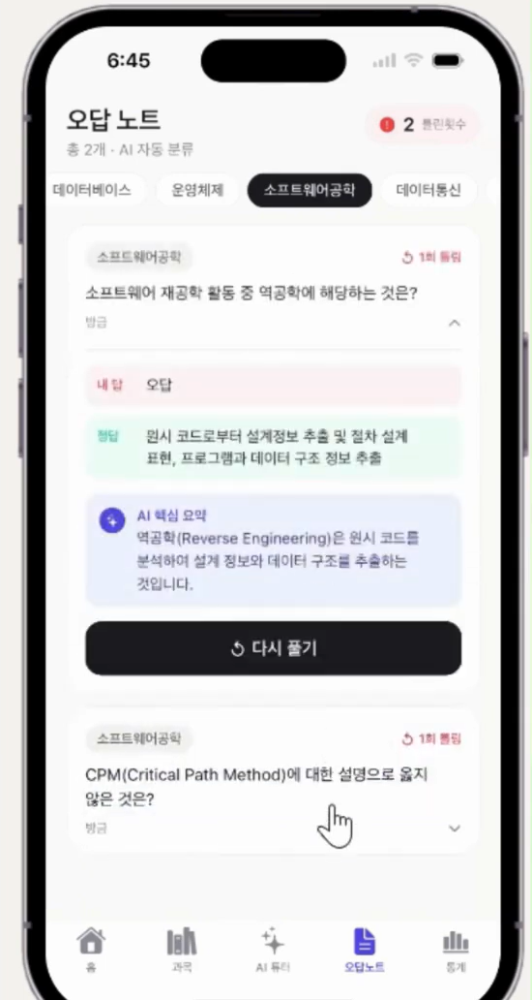

# IPEngineer

### AI 기반 정보처리기사 학습 동반자 모바일 애플리케이션

> 5과목 기출 풀이 · AI 실시간 해설 · 약점 분석 · 학습 통계를 한 손에

**개발자** &nbsp; 2271500 김지원 (한성대학교 컴퓨터공학과)

<br>

## 1. 프로젝트 수행 목적

### 1.1 프로젝트 정의

Swift / SwiftUI와 Google Gemini API를 활용하여, 정보처리기사 필기시험을 준비하는 학생이 기출 풀이·AI 해설·약점 분석·학습 통계를 한 화면에서 관리할 수 있도록 설계한 iOS 네이티브 학습 애플리케이션.

### 1.2 프로젝트 배경

정보처리기사는 컴퓨터공학 전공생에게 학점 인정, 취업 가산점, 국가기술자격 취득 등 다목적으로 활용되는 핵심 자격증이다. 그러나 시험 범위는 5과목 100문제이며, 합격 기준 또한 **평균 60점 이상이면서 각 과목 40점 이상**이라는 이중 조건을 충족해야 하므로 단순한 기출 풀이만으로는 합격을 보장하기 어렵다.

기존의 정처기 학습 앱은 대부분 정답만 표시하고 해설이 부재하거나 광고가 과도하여 학습 집중력이 떨어진다. 또한 사용자의 약점을 정량적으로 시각화하지 못해 "내가 무엇을 못하는지"를 즉시 파악하기 어렵다.

IPEngineer는 이러한 문제를 해결하기 위해 5과목 분류 기반 기출 풀이, Gemini AI의 실시간 해설, 오답 자동 누적, 과목별 정답률 시각화를 하나의 앱에 통합하여 정보처리기사 학습의 효율을 극대화하고자 한다.

### 1.3 프로젝트 목표

**과목별 기출 풀이**
정보처리기사 5과목(소프트웨어 설계·개발, 데이터베이스, 프로그래밍 언어, 정보시스템) 분류 기반 100+ 기출 데이터셋을 구축하고, 기출 / 랜덤 / 약점만 풀기 3종 학습 모드를 제공한다.

**AI 실시간 해설**
Google Gemini 2.5 Flash 모델을 호출하여 문제별 핵심 해설을 200자 이내로 자동 생성하고, 개념 설명·오답 분석·모의고사·암기카드 4개 카테고리의 챗봇 튜터를 제공한다.

**학습 데이터 분석**
풀이 기록을 영속 저장하여 과목별 정답률, 연속 학습일, 합격 예측 점수를 계산하고, 40점 미달 과목 경고와 약점 TOP 4 토픽을 자동 추출한다.

<br>

## 2. 프로젝트 개요

### 2.1 프로젝트 설명

IPEngineer는 Swift 5 / SwiftUI 2.0으로 개발된 iOS 네이티브 앱으로, **5탭 구조(홈 · 과목 · AI 튜터 · 오답노트 · 통계)** 를 통해 정보처리기사 학습의 전체 사이클을 단일 앱에 통합한다.

- 모든 풀이 기록은 `UserDefaults` 기반 영속 저장소에 자동으로 직렬화되며, Combine의 `@Published` / `@ObservableObject` 패턴으로 화면이 즉시 갱신된다.
- AI 튜터는 Google Generative Language API(Gemini 2.5 Flash)에 시스템 프롬프트를 포함한 REST 호출을 `URLSession`으로 비동기 수행하여, 메인 스레드 블로킹 없이 응답을 렌더링한다.
- `DesignSystem.swift`는 라이트 테마 기반의 단일 브랜드 컬러(`#4F46E5`)와 5과목 컬러 코드를 한 곳에 정의하여 화면 간 일관성을 보장한다.

### 2.2 프로젝트 구조

```
IPEngineer
├── Presentation Layer (SwiftUI Views)
│   ├── HomeView          — 홈 / D-day / 5과목 진도
│   ├── SubjectView       — 과목 선택 (기출·랜덤·약점)
│   ├── QuizView          — 문제 풀이 + AI 해설
│   ├── AITutorView       — Gemini 챗봇 튜터
│   ├── WrongNoteView     — 오답노트
│   └── StatsView         — 합격 예측 / 약점 분석
│
├── Business Logic Layer
│   ├── DataManager       — 풀이 기록·오답 모델 (싱글톤, @Published)
│   ├── DesignSystem      — 컬러·타이포·카드/버튼 modifier
│   └── SubjectStyle      — 5과목 분류 매핑
│
└── Data & External API
    ├── UserDefaults      — 학습 기록 영속 저장 (Codable)
    ├── sampleQuestions[] — 100+ 기출 데이터셋
    └── Gemini 2.5 Flash  — REST API (해설·튜터)
```

> View가 `DataManager`를 `@ObservedObject`로 구독 → 답안 선택 시 `saveRecord()` 호출 → `UserDefaults`에 직렬화 저장 → `@Published`로 화면 자동 갱신

### 2.3 결과물

| 홈 화면 | 과목 선택 | 문제 풀이 |
|:---:|:---:|:---:|
|  |  |  |
| D-day · 오늘의 학습 · 5과목 진도 | 5과목 카드 · 진도율 · 3종 모드 | 4지선다 · 즉시 정/오답 · AI 해설 |

| AI 튜터 | 오답노트 | 통계 |
|:---:|:---:|:---:|
|  |  |  |
| Gemini 실시간 채팅 · 빠른 질문 | 오답 자동 누적 · 다시 풀기 | 합격 예측 · 약점 TOP4 · 학습 달력 |

> 스크린샷 이미지는 `docs/screenshots/` 폴더에 추가하세요.

### 2.4 기대효과

- 하루 자투리 시간 30분 사용 시 시험일까지 약 940문제 풀이가 가능하여 합격선(평균 60점)에 안정적으로 도달할 수 있다.
- AI 해설을 통해 단순 암기가 아닌 **개념 이해 기반 학습**으로 학습 효과를 높인다.
- 약점 토픽 자동 추출로 한정된 학습 시간을 가장 비효율적인 영역에 집중 배분할 수 있다.
- 서버리스 로컬 저장 아키텍처로 운영 비용이 들지 않아 개인 프로젝트로 지속 운용이 가능하다.

### 2.5 관련 기술

| 구분 | 설명 |
|---|---|
| **SwiftUI** | Apple의 선언적 UI 프레임워크로, View 계층을 함수적으로 기술한다. `@State` / `@ObservedObject` 바인딩으로 UI와 모델의 동기화를 자동화하며 모든 화면을 코드로만 구성한다. |
| **Google Gemini API** | Google의 대화형 거대언어모델(Gemini 2.5 Flash)을 REST 엔드포인트로 직접 호출하여 정처기 기출 문제의 핵심 해설과 사용자 질문 답변을 200자 이내로 생성한다. 무료 티어로 학습 시연에 충분한 사용량을 확보한다. |
| **UserDefaults + Codable** | 풀이 기록·오답노트 등 사용자 데이터를 JSON으로 직렬화하여 키-값 저장소에 영속화한다. 서버 없이 로컬에서 즉시 동기화가 가능하다. |
| **Combine** | `DataManager`의 상태 변경을 옵저버 패턴으로 모든 구독 View에 자동 전파한다. 통계·진도바·오답 카드가 동일 데이터에 즉시 반응하여 일관된 사용자 경험을 제공한다. |
| **SF Symbol** | Apple 기본 아이콘 셋(5,000+)을 활용하여 디자인 일관성과 다이내믹 타입을 동시에 확보한다. 이모지 의존도를 낮춰 라벨링 품질과 가독성을 향상한다. |

### 2.6 개발 도구

| 구분 | 설명 |
|---|---|
| **Xcode** | Apple의 공식 통합 개발 환경(IDE). Swift / SwiftUI 코드 작성, iOS 시뮬레이터 실행, 빌드 및 디버깅을 지원한다. 본 프로젝트는 Xcode 12.5(iOS 14.5 SDK) 기준으로 빌드된다. |
| **Swift / SwiftUI** | Swift 5 언어와 SwiftUI 2.0 프레임워크를 사용하여 외부 라이브러리 의존성 없이 순수 네이티브로 구현한다. 빌드 환경 재현성과 코드 가독성을 동시에 확보한다. |
| **Google Gemini** | `generativelanguage.googleapis.com/v1beta`의 Gemini 2.5 Flash 엔드포인트를 `URLSession`으로 호출한다. 시스템 프롬프트로 "정처기 5과목 한정, 200자 이내" 제약을 사전 주입한다. |
| **Git / GitHub** | `main` / `feature/*` 브랜치 전략으로 버전을 관리하고, 코드·문서·시연 영상을 본 레포지토리에 통합한다. |

### 2.7 시연 영상

[](https://youtu.be/YOUR_VIDEO_ID)

> YouTube 링크와 썸네일 이미지를 추가하세요. (영상 길이 3분 이내)

<br>

---

### 빌드 방법

```bash
git clone https://github.com/HSU-jiwonKim/IPEngineer.git
cd IPEngineer
open IPEngineer.xcodeproj
# Xcode에서 ⌘+R 로 실행 (iOS 14.5+ 시뮬레이터)
```

> AI 튜터 기능 사용 시 `AITutorView.swift`의 `apiKey`에 본인의 Gemini API 키를 입력하세요.
> 발급: https://ai.google.dev

### 참고자료

- Apple — [SwiftUI Documentation](https://developer.apple.com/documentation/swiftui)
- Apple — [Human Interface Guidelines (iOS)](https://developer.apple.com/design/human-interface-guidelines)
- Google — [Generative AI Documentation](https://ai.google.dev/docs)
- 한국산업인력공단 — [정보처리기사 시험 정보](https://www.q-net.or.kr)
